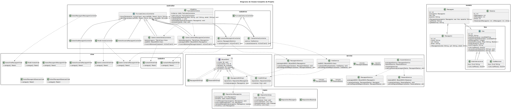

# Requisitos do projeto

| Requisitos                                                                                          | Descrição                                                                                                                                                       | Estado |
| --------------------------------------------------------------------------------------------------- | --------------------------------------------------------------------------------------------------------------------------------------------------------------- | ------ |
| Modelagem orientada a objetos com uso de classes, atributos, métodos, encapsulamento e construtores | Classes como Passageiro, Voo, Passagem, com atributos privados, métodos públicos e construtoresadequados.                                                       | [✅]    |
| Herança e polimorfismo                                                                              | Uso de herança para representar diferentes tipos de voos (ex: VooNacional, VooInternacional) e polimorfismo para o cálculo de taxas ou exibição de informações. | [✅]    |
| Interfaces ou Classes Abstratas                                                                     | Uso de interface ou classe abstrata para definir comportamento comum (ex: Reservavel, Calculavel).                                                              | [✅]    |
| Uso de Coleções Java (ArrayList ou HashMap)                                                         | Gerenciamento das listas de passageiros, voos e passagens utilizando coleções como ArrayList.                                                                   | [✅]    |
| Uso de Pacotes, Casts e Arrays                                                                      | Organização do sistema em pacotes e uso pontual de arrays e conversões.                                                                                         | [✅]     |
| Tratamento de exceções                                                                              | Tratamento de erros como seleção de voo inexistente, cadastro duplicado de passageiros, etc.                                                                    | [✅]     |
| Arquitetura em camadas (MVC)                                                                        | Separação clara entre model, view (JavaFX) e controller, conforme padrão MVC.                                                                                   | [✅]     |
| Interface gráfica com JavaFX (obrigatório)                                                          | Interface funcional que permita: cadastrar voos e passageiros, comprar passagens e visualizar reservas.                                                         | [✅]     |
| Uso de métodos estáticos ou atributos estáticos                                                     | Uso de static para identificadores automáticos,contadores ou utilitários                                                                                        | [✅]     |
| UML (parcial)                                                                                       | Diagrama UML com classes principais (Voo, Passageiro, Passagem) e seus relacionamentos.                                                                         | [✅]     |

Diagrama Uml: 

Grupo: 
- Caio Vinicius Marinho
- Dayvson da Silva Farias
- Josue Costa da Silva
- Samuel Lins Cavalcanti Braga